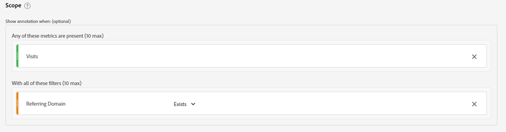

# 분석 인사이트 잠금 해제, 주석의 기능 활용

주석 데이터 구성 요소는 Adobe Analysis Workspace에서 제공되는 가장 간단하지만 장기적으로 가장 시간을 절약할 수 있는 기능 중 하나입니다. Workspace 내의 다른 기능과 달리 이 기능은 사용자와 동료 Workspace 사용자에게 나레이션된 기록 메모리 역할을 합니다.

간단히 말해, 주석은 Adobe 작업 영역 내의 날짜 트렌드 데이터에 추가할 수 있는 짧은 설명 텍스트입니다. 주석은 Analysis Workspace을 사용하여 회사의 데이터 내역을 이해하는 모든 사용자에게 컨텍스트를 제공하고 성능을 보다 신속하게 분석하며 모든 보고서에 고도로 사용자 정의된 느낌을 제공합니다.

## 사용 사례

주석이 특히 편리한 경우가 여러 가지 있습니다.

- **이상치(Peak &amp; Trough)** - 트렌드 데이터의 주요 정점과 단점의 원인을 알고 있는 경우 이상 값 데이터 포인트를 마우스 오른쪽 버튼으로 클릭하고 &quot;주석 선택&quot;을 선택하여 해당 지식을 모든 사람과 공유하십시오.

- **주요 마케팅 캠페인 및 테스트** - 마케팅 캠페인 및 테스트(A/B, 다변량 등) 은 트래픽과 성능에 직접적인 영향을 줄 수 있으므로 모든 사용자가 주석에서 이러한 캠페인 및 테스트의 일정을 문서화할 수 있습니다.

- **외부 요인 및 이벤트** - 주요 일회성 사건에서 경쟁업체 작업, 새로운 제품 릴리스 및 관련 글로벌 또는 국내 이벤트에 이르기까지 모든 것은 데이터에 관련된 외부 요인을 주석에 추가해야 합니다.

- **간격 및 오류** - 잠재적인 데이터 수집 문제에 대해 경고하려면 경고 기능을 사용해야 하지만 경험이 많은 팀에게도 불행히도 때때로 데이터 수집 오류나 일시적인 공백이 발생합니다. 주석은 사용자에게 데이터가 누락되었거나 완전하지 않다는 것을 알려 줌으로써 영향을 최소화할 수 있는 좋은 방법입니다.

## 방법

주석을 작성하고 편집하는 것은 직관적이고 거의 설명적입니다. 날짜 트렌드 시각화 또는 자유 형식 테이블 내에서 데이터 포인트를 마우스 오른쪽 버튼으로 클릭하고 &quot;주석 선택&quot;을 선택하여 주석을 만들거나 기본 탐색을 사용하여 &quot;구성 요소 > 주석&quot;을 사용하여 주석을 만들고 편집합니다.

{width="70%"}{width="30%"}

주석 작동 방식에 대한 모든 세부 정보는 [Experience League에 대한 비디오 자습서](https://experienceleague.adobe.com/en/docs/analytics-learn/tutorials/analysis-workspace/navigating-workspace-projects/annotations-in-analysis-workspace).

## 시작하기 위한 팁과 요령

마지막으로, 주석을 바로 사용할 수 있는 유용한 팁입니다.  이러한 제안을 사용하면 모든 사용자에게 주석을 효과적이고 명확하며 유용한 정보로 만드는 데 도움이 됩니다.

- **색상 코딩** - 주석 기능을 사용하면 작업 영역 프로젝트 내에 표시되는 다양한 색상 중에서 선택하여 다양한 유형의 주석을 구별할 수 있습니다. 서로 다른 여러 사이트 또는 앱을 측정하는 경우 각 사이트마다 다른 색상을 선택할 수 있습니다. 또는 주석의 각 카테고리에 대해 다른 색상을 사용할 수도 있습니다.

- **제목 레이블 지정** - 주석에 대해 사용자에게 시각적 큐를 제공하는 추가 방법은 주석의 제목에 레이블을 지정하는 것입니다. 색상 코딩과 유사하게 채널 또는 이름(예: WEB, APP 또는 ALL)별로 조직의 데이터 구조 방식에 따라 다른 레이블을 선택할 수 있습니다

- **범위** - 주석을 작성할 때 적절한 컨텍스트에 주석을 표시하기 위해 원하는 대로 전체 범위의 차원, 지표 및 제한기를 사용할 수 있습니다. 일부 주석은 특정 차원 또는 지표에만 관련되므로 주석이 해당 차원 또는 지표에 표시되는 시기를 제한할 수 있습니다.

- **다른 이름으로 저장** - 한 두 개의 주석을 만든 후 시간을 절약하는 &quot;다른 이름으로 저장&quot; 옵션을 사용하여 템플릿으로 다시 활용하여 새 주석을 만들 수 있습니다.

- **주석 관리자** - 메인 탐색을 사용하여 &quot;구성 요소 > 주석&quot;을 클릭하면 주석 관리자에 도달하며, 여기서 주석을 작성 및 특히 편집할 수 있는 광범위한 기능을 찾을 수 있습니다.

- **권한 -** 주석을 만들 수 없는 경우 Admin Console에서 &quot;주석 만들기&quot;를 허용할 수 있는 관리자에게 문의하십시오.

자세한 설명서는 다음을 참조하십시오. [주석 개요](https://experienceleague.adobe.com/en/docs/analytics/analyze/analysis-workspace/components/annotations/overview) 및 주변 기사

## 작성자

이 문서의 작성자:

Thomas Edward Buckley, Miles &amp; More(Lufthansa Group) Data Warehouse 및 Business Intelligence 관리자
