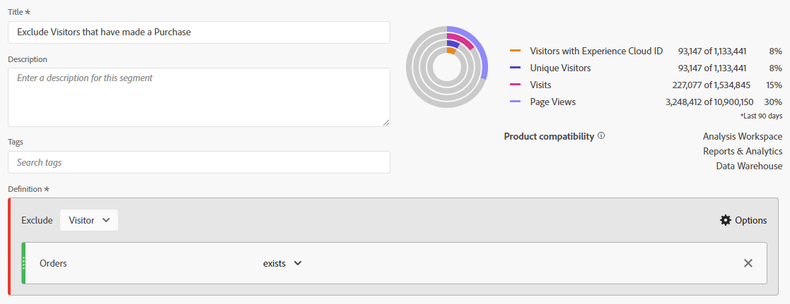
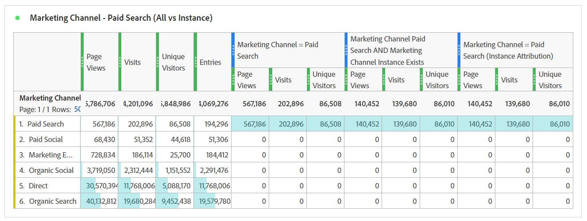
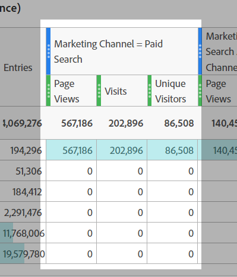
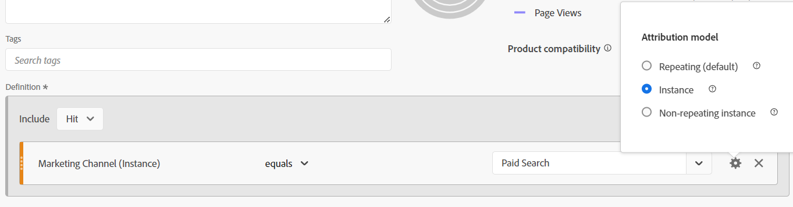

# 커튼 뒤의 마법: 복잡한 세그먼트: 제외, 컨테이너 및 속성

_복잡한 데이터 세분화의 복잡성을 파악하고 제외, 컨테이너 및 속성 모델을 살펴봅니다. 마술사의 능숙한 솜씨처럼 이러한 기술을 마스터하면 분석가가 데이터 마술을 수행할 수 있으며 정밀하고 정교하게 통찰력을 전환할 수 있습니다._

커튼이 열려 있고 무대가 설정되어 있습니다... 이것은 라스베가스의 마법 행위가 아닐 수 있지만, 우리는 우리의 세그먼트를 만들 때 몇 가지 꽤 놀라운 트릭을 수행 할 수 있습니다.

이 모듈에서는 다음 내용을 다룹니다.

- 제외 논리
- 컨테이너 사용
- 속성 모델

## 포함 및 제외

기본적으로 모든 컨테이너는 **include** 형식으로 시작되며, 기본적으로 조건과 일치하는 데이터를 반환합니다. 그러나 세그먼트 또는 세그먼트 내의 컨테이너를 **exclude** 유형으로 변경하여 특정 기준을 거부할 수도 있습니다.

마술사는 갑판에서 카드를 찾을 수 있지만, 그 마술사가 갑판의 나머지를 존재하지 않게 만들 수 있다는 것은 놀라운 일입니다. 마찬가지로, 세그먼트 제외에서 원하지 않는 데이터가 데이터 세트에서 사라지기를 원합니다.

여러분은 아마 거기에 앉아 &quot;좋아, 하지만 나는 이미 &#39;같지 않음&#39;과 &#39;포함하지 않음&#39;옵션을 가지고 있는데, 그래서 나를 가려야 하지 않을까?&quot;라고 생각할지도 모른다. 불행히도, 그것에 대한 대답은... 그리고 그것은 단지 하나의 요소를 통해 논리의 그룹을 제외할 수 있음에 대한 것이 아닙니다. 단일 구성 요소를 처리하는 경우에도 *제외*&#x200B;를 사용해야 목표를 달성할 수 있습니다.

- **포함하지 않음 / 같지 않음** - 특정 문자열이 포함되지 않은 항목에 일치하는 것 같습니다.
- **제외: 값에 / 같음** - 문자열과 일치하는 항목이 *제외*&#x200B;됩니다.

언뜻 보면 두 소리는 모두 같습니다... **히트** 수준 세그먼트/컨테이너에서는 동일한 작업을 수행하므로 정확합니다. 그러나 **방문** 또는 **방문자** 범위를 사용하면 매우 다른 결과를 얻을 수 있습니다.

**그림 1: 다음을 포함하지 않음/다음과 같지 않음 - 히트 범위**

*각 히트가 true 또는 false 값을 반환하고 does not과 exclude 간에 해당 값이 반전됩니다.*

- Value는 &quot;Example&quot;(예)을 포함하지 않으므로 true를 반환하고 해당 히트를 포함합니다. 마찬가지로 &quot;Example&quot;은 &quot;Example&quot;(아니요, 포함합니다.)을 포함하지 않으므로 false를 반환하고 해당 히트를 포함하지 않습니다. 기본적으로 실제 결과를 반환하는 모든 데이터를 반환합니다.
- Value에 &quot;Example&quot;(아니요)이 포함되어 있으면 false를 반환하고 해당 히트를 제외하지 않습니다. 마찬가지로, &quot;Example&quot;에도 &quot;Example&quot;(예)이 포함되어 있으면 true를 반환하고 해당 히트를 제외합니다. 기본적으로 **not**&#x200B;이(가) 참인 결과가 있는 데이터를 반환하거나, 거짓인 데이터를 기준에 반환합니다.
- **Hit** 수준에서 두 논리 집합이 모두 동일한 데이터 집합을 반환한다는 것을 알 수 있습니다.

**그림 2: 다음을 포함하지 않음/다음과 같지 않음 - 방문 범위**

*위와 같이&#x200B;**visit**내의 각 히트가 동일한 true/false로 평가됩니다. 그러나 반환되는 데이터 집합은 전체 방문의 데이터 집합입니다.*

- 각 히트에서 &quot;Value&quot;는 &quot;Example&quot;(예)을 포함하지 않으므로 true를 반환합니다. 마찬가지로 &quot;Example&quot;도 &quot;Example&quot;(아니요, 포함합니다.)을 포함하지 않으므로 false를 반환합니다.
   - 방문의 **any** 히트가 **true**&#x200B;을(를) 반환하면 **전체 방문**&#x200B;이 반환됩니다.*
   - 방문이 완전히 &quot;예&quot;를 포함한 히트로 이루어진 경우 어떤 히트도 true를 반환하지 않으므로 데이터 집합에서 해당 방문이 **반환되지 않습니다**.
- 다시 말하지만, 각 히트에서 &quot;Example&quot;은 &quot;Example&quot;(예)을 포함하므로 true를 반환합니다
   - **임의 히트**&#x200B;이(가) **true**&#x200B;을(를) 반환하는 경우 전체 방문은 **제외됨**&#x200B;됩니다.
   - 방문의 **모든 히트**&#x200B;가 **false**&#x200B;를 반환하면 해당 방문이 데이터 집합에서 반환됩니다
- 이제 이 논리가 어디에서 갈라지기 시작하는지 알 수 있다. 위의 예에는 세 개의 개별 방문이 있습니다.
   - &quot;포함하지 않음 / 같음&quot;을 사용하면 **세 개의** 방문 중 두 개가 반환됩니다.
   - &quot;포함/다음과 같음 제외&quot;를 사용할 때 **해당 방문 중 하나**&#x200B;만 반환됩니다

**그림 3: 다음을 포함하지 않음/다음과 같지 않음 - 방문 범위**

*위와 같이&#x200B;**visitor**에 의해 만들어진 각 히트는 동일한 true/false 논리로 평가됩니다. 그러나 지금은 이 방문자가 모든 방문 동안(선택한 날짜 범위 내) 수행한 모든 히트를 보고 있습니다.*

- 각 히트에서 &quot;Value&quot;는 &quot;Example&quot;(예)을 포함하지 않으므로 true를 반환합니다. 마찬가지로 &quot;Example&quot;도 &quot;Example&quot;(아니요, 포함합니다.)을 포함하지 않으므로 false를 반환합니다.
   - 방문자가 수행한 **any** 히트가 **true**&#x200B;을(를) 반환하면 **전체 방문**&#x200B;이 반환됩니다.
   - 방문자가 &quot;Example&quot;이 포함된 히트를 수행하지 않은 경우 어떤 히트도 true를 반환하지 않으므로 해당 방문자는 데이터 집합에서 **반환되지 않습니다**.
- 다시 말하지만, 각 히트에서 &quot;Example&quot;은 &quot;Example&quot;(예)을 포함하므로 true를 반환합니다.
   - **임의 히트**&#x200B;이(가) **true**&#x200B;을(를) 반환하면 전체 방문자(및 결과적으로 모든 방문)가 **제외됩니다.**
   - 방문의 **모든 히트**&#x200B;가 **false**&#x200B;를 반환하는 경우 해당 방문자가 데이터 집합에서 반환되어 &quot;X&quot;를 실행하지 않은 방문자가 성공적으로 반환됩니다.
- 이는 훨씬 더 많은 고려 사항이 있는 방문 논리의 확장입니다. 위의 예에는 두 명의 고유 방문자가 있으며 각각 3개의 방문이 있습니다.
   - &quot;포함하지 않음 / 같음&quot;을 사용할 때 **두 방문자 모두**&#x200B;가 반환되며, 마찬가지로 방문자의 모든 **세 명**&#x200B;이 반환됩니다(보고서에서 방문자 2명과 총 방문 횟수 6명)
   - &quot;포함/다음과 같음 제외&quot;를 사용할 때는 해당 방문자 중 **한 명**&#x200B;만 반환되고 해당 방문자와 연결된 세 개의 방문만 포함됩니다(보고서에서 방문자 1명 및 총 방문 3명 고려).

>[!TIP]
>
>특히 컨테이너를 중첩하기 시작할 때 이러한 논리는 복잡할 수 있습니다. 세그먼트가 실제로 필요하다고 생각하는 데이터를 반환하는지 확인하기 위해 통제 샘플 데이터에 대해 테스트하는 것이 좋습니다.

### 세그먼트 예 1: 구매하는 방문 제외

이 예제에서는 사이트를 방문하고 방문 중에 *not*&#x200B;을(를) 구매한 사용자를 타겟팅하려고 합니다(기본적으로 트랜잭션을 수행한 방문을 제외하려고 하므로 트랜잭션을 완료하지 않은 방문은 그대로 둡니다)

비교를 위해 &quot;존재하지 않음&quot;을 사용하여 작성된 세그먼트를 살펴보겠습니다.

미리 보기에 매우 다른 결과가 어떻게 표시되는지 확인합니다. 실제로 모든 방문에는 &quot;주문&quot; 지표를 포함하지 않는 히트가 하나 이상 있으므로 이 세그먼트는 내 방문의 100%를 반환합니다.

이를 더 설명하기 위해 두 세그먼트를 나란히 비교하겠습니다.

먼저, 세그먼트의 *visit* 수준 범위에도 불구하고 세그먼트를 다른 지표(예: 페이지 보기 수 또는 고유 방문자 수)와 연결할 수 있음을 알 수 있습니다. 첫 번째 열 세트는 세그먼트화되지 않으므로 한 세그먼트(존재하지 않음)가 거의 100%의 데이터를 반환하고 있음을 한 눈에 볼 수 있으며, 제외 세그먼트만 필요한 작업을 수행하고 있습니다.

가장 눈에 띄는 열은 주문이며, 이는 대부분의 주문이 여전히 반품되고 있기 때문에 &quot;존재하지 않음&quot; 컨테이너가 잘못되었음을 즉시 알 수 있어야 합니다.

### 세그먼트 예 2: 보고 기간 내에 구매한 방문자 제외

이 예에서는 이전 샘플(방문 수준을 구체적으로 살펴보임)의 아이디어를 사용하고, 이를 확장하여 보고서의 시간대 내에 구매하지 않은 방문자를 찾고 싶습니다.

이 세그먼트는 위의 예제와 거의 비슷하게 보이지만, 세그먼트 범위가 큰 차이를 보일 것입니다.

이제 방문자의 범위 지정 세그먼트를 위의 방문 범위 지정 세그먼트와 비교하면 *구매한 방문자*&#x200B;에게도 구매가 없는 방문이 있으므로 더 많은 데이터가 표시되고 더 많은 방문이 제외됩니다. 따라서 이러한 방문도 방문자의 라이프사이클에 포함되므로 제외됩니다.

>[!IMPORTANT]
>
>방문자 범위 데이터를 볼 때 보고서 기간이 길어질수록 많은 방문자가 사이트를 다시 방문하는 충성도가 높기 때문에 제외가 커집니다(물론 일부 비즈니스 모델의 경우 다른 비즈니스 모델보다 더 높은 영향을 받음)

>[!IMPORTANT]
>
>방문과 방문자의 차이는 *미묘한*(특히 이 샘플 데이터에서)일 수 있지만, 고려되어야 하는 고유한 논리입니다. 데이터는 사이트 및 사용자 동작에 따라 상당히 다를 수 있습니다.

보고서를 통해 전달하려는 데이터나 *스토리*&#x200B;를 정확히 알아야 합니다. 표와 시각화가 대상자에게 ***무엇을***&#x200B;하는지 명확하게 알려주고 적절한 세그먼트 모델을 사용하는 것이 적절한 분석을 수행하는 데 중요합니다. 정보에 입각한 결정은 모두가 그들이 보고 있는 것을 이해해야만 제대로 이루어질 수 있다.

## 컨테이너 사용

컨테이너는 세그먼트의 기본 논리 내에 &quot;하위 논리&quot;를 만들 수 있는 기능을 제공하며, 일반적인 오해는 세그먼트와 컨테이너 간에 범위가 모두 동일해야 하지만 그렇지 않다는 것입니다. 이를 통해 보다 큰 체계의 특정 시나리오를 만들고 복잡한 논리를 구축할 수 있는 보다 많은 자유를 얻을 수 있습니다.

컨테이너에 대해 생각하는 가장 좋은 방법은 각 컨테이너를 상자로 상상하는 것입니다. 그리고 우리는 (논리의) 상자를 다른 상자, 다른 상자 안에 쌓을 수 있습니다. 그러나 각 상자가 외부 상자보다 작아야 하는 물리적 상자와 달리, 우리는 올바른 데이터를 다시 얻을 수 있도록 우리를 유도한다면 내부에 더 큰 무언가를 넣을 수 있습니다. 마술사의 모자와 같이 생각해 보세요. 불가능은 안에 들어갈 수 있고 우리는 데이터의 마술사입니다.

### 컨테이너 범위

먼저 *컨테이너* 범위를 빠르게 분류해 보겠습니다. *세그먼트 s* cope와 마찬가지로 기본 **히트**, **방문** 및 **방문자** 범위 옵션이 있지만 경우에 따라 방문자 대신 **논리 그룹**&#x200B;이라는 옵션이 표시됩니다(순차적 세그먼트 내에서만 발생하며 다음 문서에서 다루도록 하겠습니다).

**옵션*** 메뉴에 액세스하여 세그먼트 내(또는 다른 컨테이너 내)에 컨테이너를 추가할 수 있습니다. 여러 항목을 중첩한 경우에는 올바른 블록에 추가해야 합니다. 하지만 잘못된 위치에 컨테이너를 추가하면 인터페이스 내에서 컨테이너를 끌어다 놓을 수 있습니다.

**그림 1: 컨테이너 추가**

컨테이너 범위는 부모와 독립적입니다. 위에서 언급했듯이 이 *은(는) 일치하지 않습니다*&#x200B;은(는) 일치해야 합니다. 반환할 내용에 따라 계획을 작성해야 필요한 것을 완전히 시각화할 수 있습니다. 적어도 머릿속에 익숙해질 때까지.

**그림 2: 세그먼트 범위와 컨테이너 범위**

>[!NOTE]
>
>Adobe은 유효하고 잘못된 세그먼트를 이해하는 논리가 있습니다. *절대*&#x200B;할 수 있는 옵션을 제공하지 않습니다. 따라서 히트 범위 세그먼트 내에서 방문자 범위 컨테이너를 사용하는 옵션이 표시되면 유효한 옵션입니다.

기본 세그먼트의 경우와 마찬가지로 중첩된 컨테이너가 있는 복잡한 세그먼트를 만들기 시작할 때 반환하려는 데이터의 ***종류***&#x200B;에 대한 명확한 아이디어가 필요합니다. ***어떻게*** 해당 데이터를 사용할 계획입니까? ***세그먼트와 연결할*** 지표를 계획하고 있습니까?

이러한 질문은 전체 세그먼트의 범위를 결정하는 데 도움이 됩니다. 이것이 모든 세그먼트의 시작점입니다.

세그먼트를 고유 방문자 수 지표와 쌍을 이루려고 한다고 해서 세그먼트 자체가 방문자 수준이 되어야 하는 것은 아닙니다. ... 여기에서 멀리 떨어져 있어야 합니다. 방문자 수준 세그먼트는 방문자에 대한 모든 데이터를 반환합니다. 즉, 모든 방문 횟수, 모든 페이지 보기 수 등을 의미합니다. 방문자가 세그먼트 기준과 일치하면 세그먼트는 이 방문자에 대한 *지난*&#x200B;의 데이터를 반환하기 시작할 수 있습니다(작업 영역의 날짜 범위 내에 있는 경우).

>[!IMPORTANT]
>
>세그먼트를 고유 방문자 지표와 연결하려고 계획하는 경우에도 이 *은(는) 세그먼트가 자동으로 방문자 범위가 지정되어야 함을 의미하지*&#x200B;않습니다. 이 *may* 잘못된 인식으로 부풀려지고 잘못된 결과가 생성되었습니다.

따라서 적절한 범위를 선택하는 방법에 대한 개념에 대해 많이 이야기했지만 실제로 도움이 되는 예나 세부 사항은 제공하지 않았습니다. 이제 몇 가지 실제 사용 사례 예를 통해 자세히 살펴보겠습니다. 그들은 마술사가 그들의 비밀을 절대 드러내지 않는다고 말하지만, 그것은 사실이 아니다. 마법의 세계 내에서 테크닉과 &quot;커튼 뒤&quot; 작업은 종종 동료들과 공유되고, 그들이 환상을 구축하고 개선할 수 있도록 합니다. 그것이 제가 목표로 하는 것입니다... 당신을 기다리는 가능성의 문을 여는 것입니다.

### 세그먼트 예 3: (보고 기간 내에) 최근 주문한 방문자의 특정 페이지 보기

이 시나리오에서는 최근 구매자가 히트한 특정 페이지 세트만 반환하려고 합니다(세그먼트 자체가 히트 범위에 있더라도 방문 횟수 또는 고유 방문자 수와 연결할 수 있음).

이러한 유형의 시나리오는 구매자가 사이트의 특정 페이지를 볼 수 있는지, 특정 이벤트에 명시적으로 연결되지 않았을 수 있는 페이지를 볼 수 있는지 확인하는 데 유용합니다.

내 예제는 &quot;추천 거래&quot; 및 &quot;추천 제품&quot;의 페이지를 살펴봅니다. 현재 논리를 단순하게 유지하고 순차적 세그먼테이션을 사용하지 않을 예정입니다(적어도 아직 아니지만 향후 문서에서 이와 같이 보다 복잡한 논리를 다룹니다).

또 다른 질문은 **왜**&#x200B;을(를) 조회 수로 되돌리고 있습니까? 기술적으로 여기서 방문 횟수나 방문자별로 가져올 수 있지만, 이러한 특정 페이지를 방문당 **페이지 보기 수(특정 페이지 세트의 경우)** 또는 방문자당 **페이지 보기 수(특정 세트의 경우)**&#x200B;별로 볼 수도 있습니다. 이 범위를 사용하면 이 특정 계산을 유연하게 수행할 수 있습니다. 이러한 히트는 방문 횟수 또는 고유 방문자 수와 쉽게 결합하여 이러한 페이지를 보는 방문 횟수 또는 방문자 수를 결정할 수 있으므로 모든 시나리오에 사용할 수 있는 가장 유연한 세그먼트를 선택합니다.

먼저 비교를 위해 특정 페이지에 대한 간단한 히트 기반 세그먼트를 살펴보겠습니다.

이제 복잡성에 대해 살펴보겠습니다.

여러 개의 컨테이너를 사용하고 있을 뿐만 아니라, 해당 컨테이너의 범위를 혼용하고 있다는 점에 유의하십시오. 세그먼트 전체가 히트 수준이지만 주문한 방문자도 찾고 있습니다.

이 짐을 푸는 데 약간의 시간을 보내자, 많은 일들이 진행되고 있기 때문이다.

먼저, 일일 분류를 표시하는 대신 페이지 분류를 표시합니다. 이렇게 하면 두 세그먼트를 더 잘 보여 줄 수 있습니다.

<table style="border: 0;">
    <tr>
        <td width="352" style="border: 0;">처음 세 열(페이지 보기 수, 방문 횟수 및 고유 방문자 수)은 세그먼트화되지 않으므로 사이트 내의 모든 페이지를 표시합니다. 주문이 작업에 대해 추적되므로 여기에 주문이 포함되지 않았으므로 페이지 차원의 범위에 포함되지 않습니다.</td>
        <td style="border: 0;">&lt;img src="assets/segment-example-3/segment3c-comparison-table-detail1.png" width="352"
        </td>
    </tr>
</table>

<table style="border: 0;">
    <tr>
        <td width="352" style="border: 0;">다음으로, 지정된 두 페이지에서 <strong>히트</strong>만 보면서 단순 세그먼트의 결과를 표시합니다. 분류에 있는 다른 모든 페이지는 예상대로 0이 됩니다.</td>
        <td style="border: 0;">&lt;img src="assets/segment-example-3/segment3c-comparison-table-detail2.png" width="352"
        </td>
    </tr>
</table>

<table style="border: 0;">
    <tr>
        <td width="352" style="border: 0;">이제 약간의 추가 팁이 있습니다. 고급 세그먼트의 결과를 표시하기 전에 "주문이 있음"의 다른 간단한 세그먼트를 사용했으며(히트 수준 범위에서) 이를 고유 방문자와 연결했습니다. 이렇게 하면 보고서 기간에 주문한 총 UV와 각 페이지에 도달한 UV가 반환됩니다. 다음 열 세트를 더 잘 설명하는 데 도움이 됩니다.</td>
        <td style="border: 0;">&lt;img src="assets/segment-example-3/segment3c-comparison-table-detail3.png" width="352"
        </td>
    </tr>
</table>

<table style="border: 0;">
    <tr>
        <td width="352" style="border: 0;">최종 열 세트는 복잡한 세그먼트로 스택됩니다. 주문이 있는 전체 UV는 각 페이지에서 간단한 "주문이 있음" 세그먼트와 일치하지만, 합계가 상당히 다르다는 것을 알 수 있습니다. 이 데이터 세트는 주문을 하고 페이지를 히트한 방문자로만 데이터 세트를 명시적으로 제한하므로 이에 대해 확실히 관심이 있습니다.</td> <td style="border: 0;">
        </td>
    </tr>
</table>

### 세그먼트 예 4: 추천 거래 또는 추천 제품을 히트하고 동일한 방문 내에서 주문하는 방문

위의 샘플에서는 더 작은 범위의 컨테이너 (즉, 히트) 내에 더 큰 범위 컨테이너 (즉, 방문자)를 추가하는 방법을 보여 주었습니다. 따라서 방문자 또는 방문 범위 세그먼트 내에 히트 컨테이너를 추가할 수 있다는 것은 놀라운 일이 아닙니다.

이전에 보았던 동일한 페이지 중 일부를 사용하여 이제 추천 거래 또는 추천 제품 페이지를 히트하고 동일한 방문 내에서 주문을 한 방문자를 다시 가져오는 데만 신경썼습니다.

이 세그먼트는 세 가지 범위를 모두 혼합합니다. 세그먼트의 최상위 수준은 visitor이므로, 일치하는 방문자에 대해 모든 방문의 모든 히트가 반환됩니다. 그 안에 방문 범위 컨테이너를 추가했습니다. 이렇게 하면 방문자가 주문 및 특정 페이지 방문의 특정 기준과 일치하는 방문을 최소 한 번 이상 했어야 합니다. 페이지 자체에 대한 히트 범위 컨테이너를 추가하여 OR 논리를 사용하여 추천 거래 페이지 또는 추천 제품 페이지를 찾을 수 있습니다.

이 방문자 범위 세그먼트의 이점은 이 조건에 일치하는 방문자의 **모든** 방문을 반환한다는 것입니다. 따라서 이 조합으로 이어지는 이전 방문의 동작과 이러한 시나리오 이후의 이러한 방문자의 작업을 보려면 이 세그먼트가 좋습니다.

여기에서 추천 거래/추천 콘텐츠의 히트와 주문이 존재하는 복합 세그먼트(주문과 지정된 페이지 중 하나가 모두 동일한 방문에 존재하는 경우)를 비교하고 있습니다. 복잡한 세그먼트는 두 개의 첫 번째 세그먼트가 교차하는 위치이지만 방문자 범위이므로 해당 방문자에 대한 다른 모든 방문도 반환됩니다.

## 속성 모델

세그먼트 정의 내의 기여도 분석 모델링은 대부분 히트가 아닌 만료가 있는 차원에 관련되므로 prop(항상 히트 수준)은 실제로 좋은 후보가 아닙니다. eVar, 마케팅 채널 등 하지만 이러한 설정이 실제로 설계된 것입니다.

세그먼트를 살펴보기 전에 간단한 예에서 속성 모델링이 작동하는 방식을 빠르게 검토해야 합니다.

eVar가 두 개 있다고 가정해 보겠습니다. 두 개 중 한 개는 방문 만료(eVar1)로 설정되어 있고 한 개는 30일 만료(eVar2)로 설정되어 있습니다. 간소화를 위해 내부 캠페인(icid)을 추적하려고 합니다.

**방문 1**

- 페이지 A
   - **eVar1**&#x200B;이(가) 설정되지 않았습니다.
   - **eVar2**&#x200B;이(가) 설정되지 않았습니다.
- URL에서 ?icid=promo-banner 가 있는 프로모션 배너를 클릭합니다.
- 페이지 B
   - **eVar 1** 및 **eVar 2**&#x200B;이(가) &quot;프로모션 배너&quot;로 설정되었습니다.
   - **eVar1**&#x200B;의 인스턴스가 트리거되었습니다.
   - **eVar2**&#x200B;의 인스턴스가 트리거되었습니다.
- 페이지 C
   - **eVar1**&#x200B;과(와) **eVar2**&#x200B;이(가) 모두 &quot;promo-banner&quot; 값을 유지합니다.
   - 두 eVar 모두 지속된 값을 사용하고 있으므로 eVar에 대한 인스턴스 지표는 모두 실행되지 않습니다

**방문 2**

- 페이지 D
   - **eVar1**&#x200B;이(가) 값으로 설정되어 있지 않으며 **eVar1**&#x200B;의 인스턴스가 트리거되지 않습니다.
   - **eVar2**&#x200B;이(가) 30일 만료로 인해 &quot;promo-banner&quot; 값을 유지합니다.
   - 값이 지속적이고 실제로 설정되지 않았으므로 **eVar2**&#x200B;의 인스턴스가 트리거되지 않습니다.
- URL에서 사이드 레일 프로모션 을 클릭합니다(?icid=promo-side-rail).
- 페이지 E
   - **eVar 1** 및 **eVar 2**&#x200B;이(가) &quot;프로모션 측 레일&quot;로 설정되어 있습니다.
   - **eVar1**&#x200B;의 인스턴스가 트리거되었습니다.
   - **eVar2**&#x200B;의 인스턴스가 트리거되었습니다.
- 페이지 F
   - **eVar1**&#x200B;과(와) **eVar2**&#x200B;이(가) 모두 &quot;promo측 레일&quot; 값을 유지합니다.
   - 두 eVar 모두 지속된 값을 사용하고 있으므로 eVar에 대한 인스턴스 지표는 모두 실행되지 않습니다

현재, 다음 두 방문에서 예상되는 결과는 다음과 같습니다.

<table><tr><th colspan="1" valign="top"></th><th colspan="1" valign="top"></th><th colspan="1" valign="top"><b>페이지 보기 횟수</b></th><th colspan="1" valign="top"><b>방문 횟수</b></th><th colspan="1" valign="top"><b>eVar1의 인스턴스</b></th><th colspan="1" valign="top"><b>eVar2 인스턴스</b></th></tr>
<tr><td colspan="1" valign="top"></td><td colspan="1" valign="top"></td><td colspan="1" valign="top">6</td><td colspan="1" valign="top">2</td><td colspan="1" valign="top">2</td><td colspan="1" valign="top">2</td></tr>
<tr><td colspan="1" rowspan="7" valign="top">페이지</td><td colspan="1" valign="top"></td><td colspan="1" valign="top">6</td><td colspan="1" valign="top">2</td><td colspan="1" valign="top">2</td><td colspan="1" valign="top">2</td></tr>
<tr><td colspan="1" valign="top">페이지 A</td><td colspan="1" valign="top">1</td><td colspan="1" valign="top">1</td><td colspan="1" valign="top">0</td><td colspan="1" valign="top">0</td></tr>
<tr><td colspan="1" valign="top">페이지 B</td><td colspan="1" valign="top">1</td><td colspan="1" valign="top">1</td><td colspan="1" valign="top">1</td><td colspan="1" valign="top">1</td></tr>
<tr><td colspan="1" valign="top">페이지 C</td><td colspan="1" valign="top">1</td><td colspan="1" valign="top">1</td><td colspan="1" valign="top">0</td><td colspan="1" valign="top">0</td></tr>
<tr><td colspan="1" valign="top">페이지 D</td><td colspan="1" valign="top">1</td><td colspan="1" valign="top">1</td><td colspan="1" valign="top">0</td><td colspan="1" valign="top">0</td></tr>
<tr><td colspan="1" valign="top">페이지 E</td><td colspan="1" valign="top">1</td><td colspan="1" valign="top">1</td><td colspan="1" valign="top">1</td><td colspan="1" valign="top">1</td></tr>
<tr><td colspan="1" valign="top">페이지 F</td><td colspan="1" valign="top">1</td><td colspan="1" valign="top">1</td><td colspan="1" valign="top">0</td><td colspan="1" valign="top">0</td></tr>
</table>

<table><tr><th colspan="1" valign="top"></th><th colspan="1" valign="top"></th><th colspan="1" valign="top"><b>페이지 보기 횟수</b></th><th colspan="1" valign="top"><b>방문 횟수</b></th><th colspan="1" valign="top"><b>eVar1의 인스턴스</b></th></tr>
<tr><td colspan="1" valign="top"></td><td colspan="1" valign="top"></td><td colspan="1" valign="top">4</td><td colspan="1" valign="top">2</td><td colspan="1" valign="top">2</td></tr>
<tr><td colspan="1" rowspan="3" valign="top">eVar</td><td colspan="1" valign="top"></td><td colspan="1" valign="top">4</td><td colspan="1" valign="top">2</td><td colspan="1" valign="top">2</td></tr>
<tr><td colspan="1" valign="top">프로모션 배너</td><td colspan="1" valign="top">2</td><td colspan="1" valign="top">1</td><td colspan="1" valign="top">1</td></tr>
<tr><td colspan="1" valign="top">프로모션 사이드 레일</td><td colspan="1" valign="top">2</td><td colspan="1" valign="top">1</td><td colspan="1" valign="top">1</td></tr>
</table>

<table><tr><th colspan="1" valign="top"></th><th colspan="1" valign="top"></th><th colspan="1" valign="top"><b>페이지 보기 횟수</b></th><th colspan="1" valign="top"><b>방문 횟수</b></th><th colspan="1" valign="top"><b>eVar2 인스턴스</b></th></tr>
<tr><td colspan="1" valign="top"></td><td colspan="1" valign="top"></td><td colspan="1" valign="top">5</td><td colspan="1" valign="top">2</td><td colspan="1" valign="top">2</td></tr>
<tr><td colspan="1" rowspan="3" valign="top">eVar</td><td colspan="1" valign="top"></td><td colspan="1" valign="top">5</td><td colspan="1" valign="top">2</td><td colspan="1" valign="top">2</td></tr>
<tr><td colspan="1" valign="top">프로모션 배너</td><td colspan="1" valign="top">3</td><td colspan="1" valign="top">2</td><td colspan="1" valign="top">1</td></tr>
<tr><td colspan="1" valign="top">프로모션 사이드 레일</td><td colspan="1" valign="top">2</td><td colspan="1" valign="top">1</td><td colspan="1" valign="top">1</td></tr>
</table>

이제 세그먼트에서 속성을 설정할 수 있는 위치를 살펴보겠습니다.

**그림 4: 속성 모델**

*차원의 톱니바퀴 아이콘으로 속성을 설정할 수 있습니다. 각 옵션에는 마우스로 &quot;?&quot;를 가리키면 사용할 수 있는 정보가 있습니다. 아이콘. 기본적으로:*

- 기본 동작은 값이 설정된 eVar의 모든 인스턴스를 반환합니다(구체적으로 또는 속성 설정을 통해)
- 인스턴스는 값이 명시적으로 설정된 차원(즉, &quot;eVar 인스턴스&quot;가 트리거된 히트에서)만 반환합니다
- 반복되지 않는 인스턴스는 차원의 값이 처음 설정될 때만 반환됩니다(즉, 위의 예에서 다루지 않지만 사용자가 프로모션 배너를 여러 번 클릭했다고 가정해 보십시오. 이는 또한 배너를 클릭할 때마다 &quot;eVar 인스턴스&quot;를 증가시키며 이 설정은 &quot;프로모션 배너&quot;의 첫 번째 고유 인스턴스만 취하고 이 배너의 후속 카운트는 무시합니다.)

### 세그먼트 예 5: 마케팅 채널 &quot;유료 검색&quot;과 유료 검색의 직접 인스턴스 비교

우리 모두가 알고 있는 바와 같이, 마케팅 채널에는 긴 속성 모델(기본적으로 30일이지만 사용자 자신의 필요에 따라 맞춤화할 수 있음)이 있으며, 일단 설정되면 특정 드라이버가 전환 속성을 가져오도록 후속 &quot;직접&quot; 사이트 방문으로 마케팅 채널을 덮어쓰지 않습니다. 그러나 경우에 따라 특정 마케팅 채널을 통해 사이트에 대한 ***항목***&#x200B;을 확인해야 합니다. 즉, 항목별로 마케팅 채널이 마케팅 처리 규칙에 따라 구체적으로 설정되는 시기를 확인해야 합니다.

상황을 좀 더 발전시켜 보고 먼저 비교를 시작한 다음, 세그먼트를 파헤쳐 보겠습니다.

<table style="border: 0;">
    <tr>
        <td width="352" style="border: 0;">처음 4개의 열은 세분화되지 않았으므로 이해하기 쉬워야 합니다. *"시작"*은 기본적으로 방문자가 세션을 시작하는 위치를 기반으로 계산된 값입니다. 사용자가 여러 마케팅 채널(소셜 미디어 조회, 검색, 마케팅 이메일 클릭 등을 통해 사이트)을 통해 입력할 수 있으므로 이것이 우리가 찾는 정보를 반환하지 않는다는 것을 보여주기 위해 여기에 추가했습니다. 모두 동일한 방문/세션 내에 있어야 합니다.)</td> <td style="border: 0;">
        </td>
    </tr>
</table>

<table style="border: 0;">
    <tr>
        <td width="352" style="border: 0;">다음 열 세트는 "표준 히트 세그먼트"를 사용하며, 기본적으로 마케팅 채널이 "유료 검색"인 히트를 봅니다. 하지만 이렇게 하면 마케팅 채널 속성에 따라 모든 히트가 반환되고 실제 "유료 검색" 클릭스루가 분리되지 않습니다. 따라서 필요한 데이터가 반환되지 않습니다.</td> <td style="border: 0;">
        </td>
    </tr>
</table>

<table style="border: 0;">
    <tr>
        <td width="352" style="border: 0;">이제, 다음 두 세트의 데이터는 동일하게 보입니다. 그리고 실제로 이 두 세트는 동일한 데이터를 두 가지 다른 방식으로 반환합니다. 하지만 지금은 마케팅 채널이 "유료 검색"으로 <strong>설정</strong>된 <i>인스턴스</i>를 특별히 찾고 있습니다.</td> <td style="border: 0;">
        </td>
    </tr>
</table>

이 작업은 다음 두 가지 방법으로 수행할 수 있습니다.

먼저, &quot;표준&quot; 차원 속성을 사용하고 이것을 특정 &quot;마케팅 채널 인스턴스&quot; 지표(*존재함* 논리로서)와 연결합니다.

또는 더 간단한 세그먼트의 경우 속성을 &quot;인스턴스&quot;로 변경할 수 있습니다. 차원 이름이 &quot;마케팅 채널&quot;에서 &quot;마케팅 채널(인스턴스)&quot;로 변경됩니다.

## 모두 합치기

여느 훌륭한 마술사처럼, 우리는 각각의 개별적인 트릭으로 시작할 수 있고, 우리가 갈 때 청중을 키우며, 그들을 마지막 &#39;명성&#39;으로 이끌 수 있다. 이 곳은 우리가 정말 빛나는 곳입니다. 모든 작은 트릭들을 가져와서 멋진 피날레로 만들어 내죠. 겉으로 보기에는 단절되어 보이는 부분을 가져와서, 실제로, 그들은 모두 함께 협동하여 응집력 있는 전체를 형성합니다.

### 세그먼트 예 6: 유료 소셜 인스턴스를 사용하여 방문 중에 주한 방문자이며 뉴스레터에 등록한 방문자는 제외됨

이렇게 하면 소셜 미디어 캠페인에서 방문 중에 적극적으로 구매를 했지만 뉴스레터에 등록하지 않은 방문자를 식별할 수 있습니다. 이렇게 하면 마케팅 팀이 뉴스레터 및 마케팅 이메일에 대해 전환하려고 시도할 수 있는 잠재적인 사용자 그룹을 볼 수 있습니다.

## 마지막

논리를 조합해서 아주 상세한 시나리오로 만드는 방법은 아주 다양해서 나는 단지 가능성의 겉만 긁어낼 수 있다.

여느 훌륭한 마술사처럼, 진정한 힘은 기본을 바탕으로, 배움을 새롭고 멋진 것으로 다시 상상하도록 후진 세대에게 영감을 주는 것입니다! 여러분 모두가 어떤 생각을 하게 될지 기대됩니다!

## 작성자

이 문서의 작성자:

Jennifer Dungan, Torstar의 최적화 관리자 분석

Adobe Analytics 챔피언

