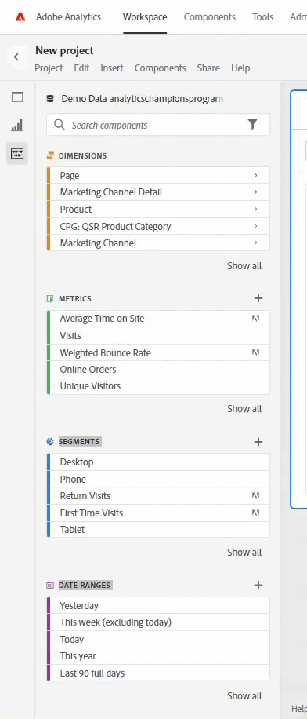

# 태그 - 개인 비서

_필요한 #TAGS을 효율적으로 찾기 위해 개인 비서 역할을 하면서 디지털 분석을 간소화하는 방법에 대해 알아보십시오. Adobe Analytics 챔피언 Jeff Bloomer는 도구의 이점을 극대화하는 데 대한 전문가의 통찰력을 공유합니다._

다들 어렸을 때 술래잡기나 숨바꼭질까지 했던 걸 기억하죠?

가장 좋았던 부분은 우리가 그것을 다시 기본(태그)으로 되돌리거나 누군가 &quot;올리 올리 황소 무료!&quot;라고 소리치는 것을 들을 때까지 가장 오래 숨어있거나(숨바꼭질) 숨어있었던 사람들이었을 때이다. (&quot;모든 너희는 자유롭게 나가라,&quot; 독일어에서 파생된 &quot;alle alle auch sind frei!&quot;).  결국 다른 모든 사람들이 출루했거나, 발견되었거나, 누군가 &quot;그것&quot;이라는 꼬리표를 달았다는 것을 의미했고, 우리는 여전히 다른 라운드를 할 자유가 있었다!

중요한 부분은 게임이 꼬리표였는지 숨바꼭질이었는지, 모두가 계속해서 발견되는 재미있는 활동을 하고 있었다.

우리가 일상 업무로 눈을 돌리면, 사물을 찾는 일은 훨씬 덜 모험적이고 훨씬 더 지루한 것으로 보입니다. 하지만 굳이 그럴 필요는 없어요. 만약 우리가 맨 앞에 있는 약간의 일을 할 의향이 있다면 말이죠.  우리 가족에게 잘 알려진 문구는 &quot;대부분의 고통은 자해입니다.&quot; 입니다. 그러나 요즘 다소 구식처럼 보일 수 있지만, &quot;제때 한 땀이 아홉을 구한다&quot;는 이 상황에서도 관련성이 높은 더 유명한 구절이 있다. 벤저민 프랭클린

이제 여러분의 관심을 끌었으니, 제가 질문을 하는 것으로 시작하겠습니다.

여러분 중 몇 분이나 이런 일을 하셨습니까?  을(를) 찾기 시작했습니다. **차원**, **날짜 범위**, **세그먼트**, 또는 **계산된 지표**, 그리고 이 거대한 목록이 쇄도합니다(참조). **그림 1**) 원하지 않는 모든 항목을 포함합니다.  ***Analysis Workspace*** 도움이 되려고 노력하는 것이라고 생각하지만, 실제로는 전혀 도움이 되지 않는 데만 성공했습니다.

*그림 1 - &quot;year&quot; 검색*

더 좋은 것은, 여러분들이 가서 *신규* **날짜 범위** 및 **세그먼트**, 그리고 &quot;너무 새로운&quot; 항목이므로 다음에 들어올 때 이러한 항목을 빠르고 쉽게 찾을 수 있다고 생각할 수 있습니다 ***Adobe 작업 영역***. 내 말이 맞아?

네 거품을 터뜨리는 건 싫지만 그냥 떠나려고 해 ***Adobe Analytics*** 당신이 당신의 새로운 &quot;작은 친구&quot;의 모두를 만든 후, 그리고 당신이 돌아왔을 때, 그들 중 대다수는 단순히 달아났습니다.  운이 좋으시다면, *아마도* 그들 가운데 한 사람은 너를 기다리려고 뒤에 남았지만, 나머지는 이미 오래전에 가서 숨바꼭질을 하고 있다.

## 규칙서 재작성

그래서, 그것은 첫날부터 게임이었지만, 우리가 규칙을 바꿀 수 있다면 어떨까요?

사실, 만약 우리가 그 규칙들을 영원히 바꿀 수 있는 개인 비서를 만들 수 있다면 어떨까요?

진짜로, 우리가 여기서 말하는 것은 태그입니다!  그래!!  그것은 우리의 친구입니다. 해시태그는, 우리가 우리의 전화에서 보았던 것처럼, 이전에 &quot;숫자&quot;와 &quot;파운드 기호&quot;로 알려졌습니다.  우리 음악가들은 심지어 그것을 &quot;날카로운&quot; 이라고 부르기도 한다.

다음 사용자를 위해: *정말로* 미리 알림이 필요합니다. 형태는 다음과 같습니다. **#**

어쨌든, 우리가 말하는 이유는 **#tags** 왜냐하면 그들은 &quot;지루하고 지루하고, 따분한 것&quot;이라는 &quot;선택적인 버킷&quot;에 묶여있기 때문입니다. 모든 사람들이 (설명처럼) 무시하는 경향이 있습니다. 왜냐하면 우리 모두는 이와 같이 더 중요한 것들을 만들기 위해 서두르고 있기 때문입니다.

- 작업 공간 보고서
- 세그먼트
- 계산된 지표
- 날짜 범위

현실을 직시하세요!  이름을 대면, 우리는 그들이 왜 빠지게 되는지에 대한 모든 변명을 보고 들었습니다.

&quot;오, 이봐, 하지만 그건 쉬워.  나는 언제든지 나중에 돌아와서 점심 시간 두세 번, 혹은 아마도 내가 회의에 앉아 있을 때 조차도 그러한 것들을 업데이트할 수 있다. *모든 작업을 처리하십시오.*&#x200B;하지 않은 모든 사람이 말했다.

## 도구 상자에 있는 항목

**Adobe** WE THE PEOPLE은 어떤 #TAGS에서 출발해야 했기 때문에, 선별된 일련의 시스템을 즉시 만들어주는 서비스를 제공하기도 했습니다.  조금 있다가 몇 가지 주의 사항을 추가로 제공하겠지만, 내가 먼저 시연하는 것은 당신에게 가장 큰 이익을 줄 것입니다!

자신만의 고유한 을 만들기 전에 먼저 알아야 할 사항은 기존 을 검색하는 방법입니다 **태그**:

새 프로젝트이든 기존 프로젝트이든 구성 요소 검색 창으로 이동하여 이러한 주요 용어 중 하나와 함께 #hashtag(비디오만 시청) 입력하고 Enter 키를 누르면 됩니다. 또는 인식할 수 있는 용어가 발견될 때까지 간단히 스크롤할 수 있습니다.

첫 번째 주의 사항: 염두에 두어야 할 사항은, 을(를) 만들 때 적절한 이름 지정 규칙에 충실해야 하는 경우입니다. *소유* 태그, 거의 모든 *대문자 사용* 태그 표시 *다음과 같아야 함*, 그리고 나는 &quot;should&quot;라는 단어에 주의할 것입니다. **Adobe**, 바로 사용 가능한 태그가 지정된 항목입니다.  즉, 만든 모든 태그가 들어 있는지 확인합니다 **소문자**.

## 자신만의 개인 비서 만들기

자, 아까 제가 &quot;개인 비서&quot;에 대해 말했던 것으로 돌아갑시다.  만약 여러분이 가장 좋아하는 기존 구성 요소 중 일부를 선택하고 그것들을 여러분이 볼 수 있는 유일한 것으로 만들 수 있다고 말한다면 어떨까요?

1. 여러 구성 요소를 선택하기 시작하면(Ctrl+왼쪽 클릭) 일부 아이콘이 위쪽에 나타납니다.  그 중 하나가 태그 아이콘입니다.
1. 해당 태그를 클릭하면 태그 대화 상자가 열리고 여기서 해당 구성 요소와 연관된 기존 태그를 볼 수 있습니다.
1. 이 화면에서 다음을 할당할 수 있습니다. **추가/신규** 이 시점에서 원하는 태그를 지정할 수 있습니다.  (예: **test\_v1**)
1. 구성 요소에 NEW 태그를 추가하려면 을 누릅니다 **입력** 를 클릭하고 SAVE 버튼을 클릭합니다.
1. 그런 다음 새 TAG를 할당하면 hashtag(#) 및 새 TAG를 입력하여 검색할 수 있습니다.

말장난은 용서해 주시지만, &quot;#tag, 당신이 끝이에요!&quot;  당신은 단지 미래에 훨씬 덜 찾게 자신을 구했습니다!  이제 당신은 당신의 실사와 힘든 일이 마침내 어떻게 될지를 보게 될 것이다.

## 개인 비서를 작업에 배치

다음 작업을 수행한다고 가정해 보겠습니다. **여행 산업** 그리고 우리는 그들의 보고서를 모으고 있습니다 **핵심 업무 시간**.  우리가 단지 &quot;여행&quot;이라는 용어에 대한 검색을 수행하기 시작한다면, 우리는 우리가 필요로 할 수 있는 것보다 훨씬 더 많은 결과를 얻을 수 있습니다.  사실, 만약 우리가 **작업 영역** 필요한 결과의 절반이라도 포함된 구성 요소는 여전히 즉시 사용할 수 없습니다.

그러나 매일 작업하는 동안 정기적으로 태그를 지정하여 작업을 수행하고 있습니다 **세그먼트**, **지표**&#x200B;및 기타 관련성 **구성 요소** 우리가 갈 때, 그리고 아마도 우리가 우리의 새로운 것을 만들 때 몇 가지 새로운 것을 만들 것입니다 **작업 영역**, 우리는 우리가 어떻게 우리의 이익에 따라 규칙 책을 다시 쓸 수 있는지 진지하게 보여줍니다!

이 경우 이름이 인 #tag의 모든 항목에 대한 간단한 #core을 만들었습니다.

여러분이 계속해서 여러분의 작업 습관의 한 부분을 만들고 이것을 반복해서 하기 위해 여러분의 기술을 향상시키면서, 여러분은 #tags을 사용하는 것이 여러분의 개인 비서를 갖는 것과 더 비슷해질 것이라는 것을 깨닫게 될 것입니다.

좀 더 현실적인 예를 원하십니까? 다음 사항을 고려하십시오.

1. 예를 들어 를 쉽게 찾을 수 있는 방법은 무엇입니까? **세그먼트** 및 내 **날짜 범위** 대상 **모든 분기** 위치: **2023**?

   

   *추가 팁*: 오른쪽에 있는 작은 사각형을 사용하면 정렬된 순서를 변경할 수도 있습니다. *알파벳순*!

1. 물론, 모든 사용자가 **캠페인 추적 코드** 어느 정도까지는.  다음 내용에 대해 명확하게 알고 싶다면 *본인* 완구, 추가고려 **#tag**&#x200B;을 사용하여 다른 모든 노이즈를 확인하고 필터링해야 하는 핵심 항목만 선별할 수 있습니다.

## 이제 나가서 놀아!

물론, 숨바꼭질은 어릴 때 재미있었지만, 이제 우리는 어른이다.  우리는 중요한 것을 끊임없이 탐색할 시간이 없으므로, 자신을 부탁하고 도구에 맞서 싸우는 데 더 이상 시간을 낭비하지 마십시오.  규칙을 다시 작성하고 이 도구를 사용할 수 있도록 합니다.

### 태그, 넌 끝이야!

## 작성자

이 문서의 작성자:

**제프 블로머**, Kroger Personal Finance의 디지털 분석 관리자

Adobe Analytics 챔피언

